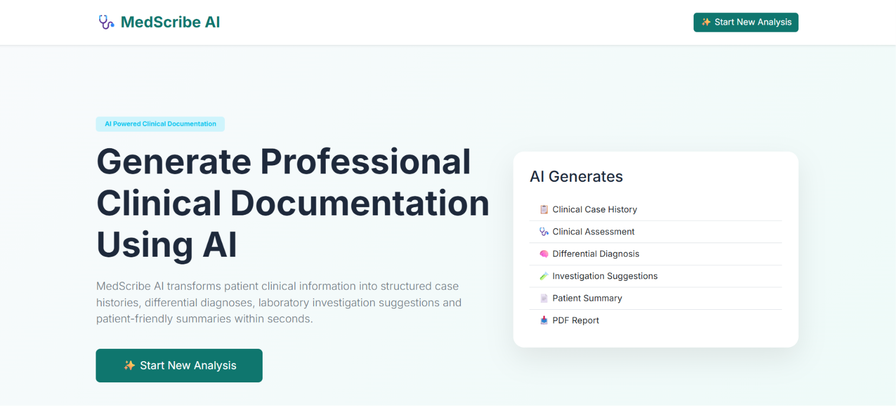
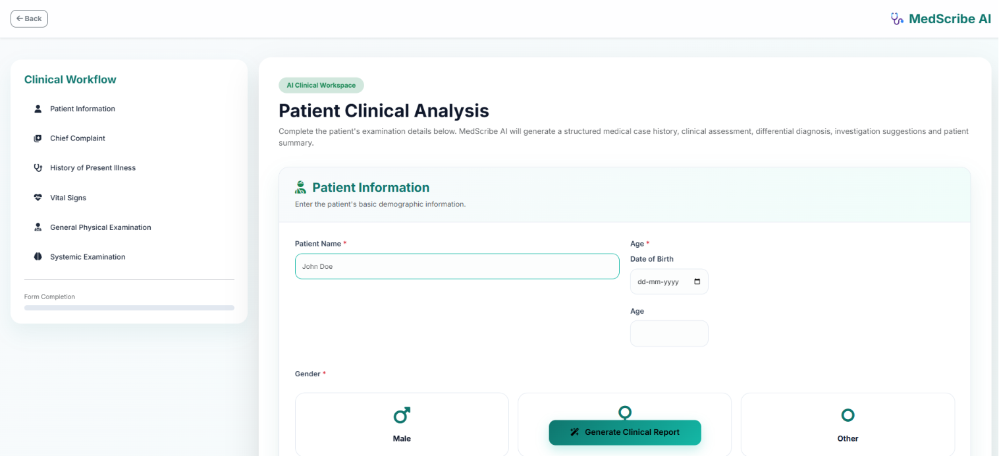
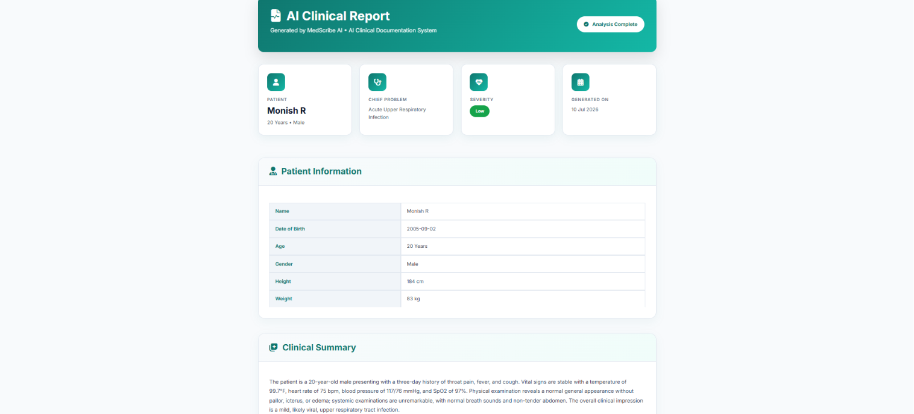
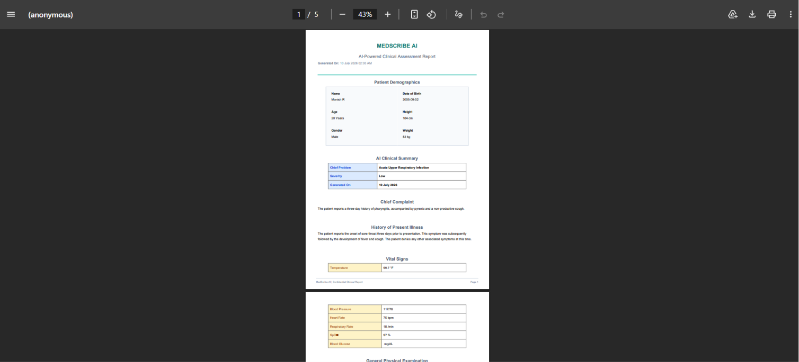

# 🩺 MedScribe AI
### AI-Powered Clinical Case History & Medical Report Generator

<p align="center">


</p>

---

## 📌 Overview

**MedScribe AI** is an AI-powered clinical documentation assistant that automatically generates structured medical case reports from patient information entered by healthcare professionals.

The application leverages **Google Gemini AI** to analyze patient symptoms, vital signs, examination findings, and clinical history to produce a comprehensive medical report including differential diagnosis, laboratory investigations, treatment considerations, and follow-up recommendations.

---

## ✨ Features

✅ Modern AI-inspired Medical Dashboard

✅ Patient Information Management

✅ Vital Signs Recording

✅ General Physical Examination

✅ Systemic Examination

✅ AI Generated Clinical Summary

✅ Differential Diagnosis

✅ Recommended Laboratory Tests

✅ Recommended Imaging

✅ Clinical Assessment

✅ Treatment Considerations

✅ Red Flag Detection

✅ Follow-up Recommendations

✅ Download Clinical Report as PDF

✅ Professional Loading Animation

✅ Responsive UI

---

# 🏗️ System Architecture

```
Patient Information
        │
        ▼
 Flask Web Application
        │
        ▼
 Prompt Builder
        │
        ▼
 Google Gemini AI
        │
        ▼
 JSON Response
        │
        ▼
 Response Parser
        │
        ▼
 Clinical Report
        │
        ▼
 PDF Generator
```

---

# 🖥️ Screenshots

## Home Page

> ## 🏠 Home Page



```
screenshots/home.png
```

---

## Patient Analysis Form

> ## 🩺 Patient Analysis



```
screenshots/analysis.png
```

---

## AI Clinical Report

> ## 📋 AI Clinical Report



```
screenshots/report.png
```

---

## PDF Report

>## 📄 PDF Report



```
screenshots/pdf.png
```

---

# ⚙️ Tech Stack

### Backend

- Python
- Flask

### Frontend

- HTML5
- CSS3
- Bootstrap 5
- JavaScript

### AI

- Google Gemini API

### PDF Generation

- ReportLab

### Other Libraries

- Jinja2
- JSON
- Python Standard Library

---

# 📂 Project Structure

```
MedScribe-AI/

│

├── app/

│   ├── routes/

│   ├── services/

│   ├── templates/

│   ├── static/

│   ├── utils/

│   └── config.py

│

├── run.py

├── requirements.txt

├── .env

└── README.md
```

---

# 🚀 Installation

Clone the repository

```bash
git clone https://github.com/YOUR_USERNAME/MedScribe-AI.git
```

Go into the project

```bash
cd MedScribe-AI
```

Create virtual environment

```bash
python -m venv venv
```

Activate virtual environment

### Windows

```bash
venv\Scripts\activate
```

### Linux / Mac

```bash
source venv/bin/activate
```

Install dependencies

```bash
pip install -r requirements.txt
```

Create a `.env` file

```env
GEMINI_API_KEY=YOUR_API_KEY
```

Run the application

```bash
python run.py
```

Open

```
http://127.0.0.1:5000
```

---

# 📄 Generated Report Includes

- Patient Summary
- Clinical Summary
- Chief Complaint
- History of Present Illness
- Clinical Assessment
- Differential Diagnosis
- Recommended Laboratory Tests
- Recommended Imaging
- Red Flags
- Treatment Considerations
- Follow-up Recommendation

---

# 🧠 AI Workflow

```
Patient Data

      ↓

Prompt Builder

      ↓

Gemini AI

      ↓

Structured JSON

      ↓

Parser

      ↓

Beautiful Medical Report

      ↓

Professional PDF
```

---

# 🔒 Disclaimer

This application is intended **only for educational and research purposes**.

The generated report **must not** be considered a medical diagnosis or treatment recommendation.

Clinical decisions should always be made by qualified healthcare professionals.

---

# 🌟 Future Enhancements

- Doctor Login
- Patient History Database
- Multi-language Support
- Voice-to-Clinical Notes
- Medical Image Analysis
- HL7/FHIR Integration
- Electronic Health Record Integration
- AI Chat Assistant for Doctors

---

# 👨‍💻 Author

**Monish R**

Computer Science Engineering Student

AI • Machine Learning • Generative AI Enthusiast

GitHub:
https://github.com/monishr024

LinkedIn:
https://www.linkedin.com/in/monish-r-5778ba292

---

# ⭐ Support

If you found this project useful,

please consider giving it a ⭐ on GitHub.

It motivates future development.